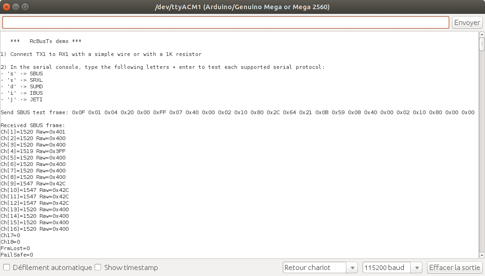

RcBusRx library: a multiple decoder for RC serial buses
===============

**RcBusRx** is a library designed to extract RC channels from RC serial bus frames. Actually, it supports SBUS, SRXL, SUMD, IBUS and JETI.

Tip and Tricks:
--------------
Debug your project on an arduino UNO or MEGA, and then shrink it by recompiling and loading the debugged sketch in an ATtiny or Digispark (pro). An hardware serial port is recommanded.

API/methods:
-----------
* **void serialAttach(Stream *RxStream)**: attach the library to the serial port
* **void setProto(uint8_t Proto)**: set the serial protocol (choose among RC_BUS_RX_SBUS, RC_BUS_RX_SRXL, RC_BUS_RX_SUMD, RC_BUS_RX_IBUS, RC_BUS_RX_JETI)
* **void process(void)**: to be placed in **loop()**
* **uint8_t isSynchro(uint8_t SynchroClientIdx = 7)**: indicates a serial frame just arrived and channel values are available
* **uint16_t rawData(uint8_t Ch)**: return raw value for channel[Ch] with Ch in [1, n] (n is the amount of channels)
* **uint16_t width_us(uint8_t Ch)**: return the pulse with (in µs) corresponding to the raw value for channel[Ch] with Ch in [1, n] (n is the amount of channels)
* **uint8_t channelNb(void)**: return the amount of channels detected in the serial frame
* **uint8_t flags(uint8_t FlagId)**: return the flags ( FrameLost and FailSafe flags for protocols which provide them)

Constants for version management:
--------------------------------
	* **TINY_DBG_VERSION**: returns the library version (integer)
	* **TINY_DBG_REVISION**: returns the library revision (integer)

Other constants:
---------------
	* **SBUS_RX_SERIAL_CFG**: initialize serial port with this (eg: Serial1.begin(SBUS_RX_SERIAL_CFG)) for SBUS
	* **SRXL_RX_SERIAL_CFG**: initialize serial port with this (eg: Serial1.begin(SRXL_RX_SERIAL_CFG)) for SRXL
	* **SUMD_RX_SERIAL_CFG**: initialize serial port with this (eg: Serial1.begin(SUMD_RX_SERIAL_CFG)) for SUMD
	* **IBUS_RX_SERIAL_CFG**: initialize serial port with this (eg: Serial1.begin(IBUS_RX_SERIAL_CFG)) for IBUS
	* **JETI_RX_SERIAL_CFG**: initialize serial port with this (eg: Serial1.begin(JETI_RX_SERIAL_CFG)) for JETI
	* 
	* **RC_BUS_RX_SBUS**: Used to set SBUS protocol (RcBusRx.setProto(RC_BUS_RX_SBUS))
	* **RC_BUS_RX_SRXL**: Used to set SRXL protocol (RcBusRx.setProto(RC_BUS_RX_SRXL))
	* **RC_BUS_RX_SUMD**: Used to set SUMD protocol (RcBusRx.setProto(RC_BUS_RX_SUMD))
	* **RC_BUS_RX_IBUS**: Used to set IBUS protocol (RcBusRx.setProto(RC_BUS_RX_IBUS))
	* **RC_BUS_RX_JETI**: Used to set JETI protocol (RcBusRx.setProto(RC_BUS_RX_JETI))

RcBusRxDemo usage :
------------------

Contact
-------

If you have some ideas of enhancement, please contact me by clicking on: [RC Navy](http://p.loussouarn.free.fr/contact.html).

